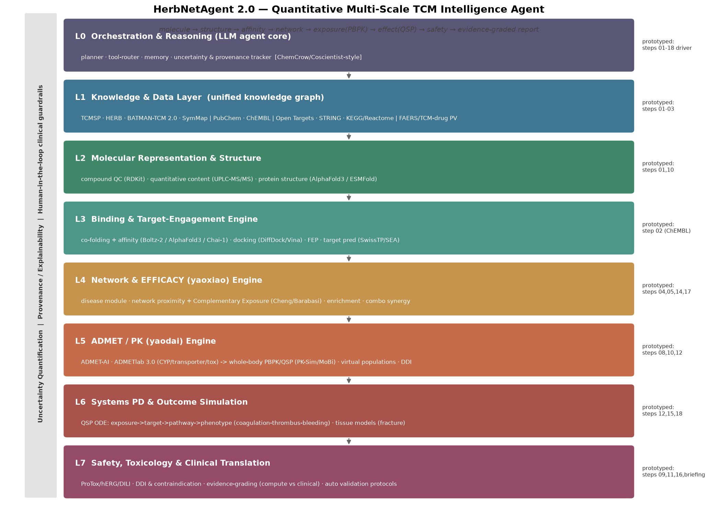

# HerbNetAgent — 大黄蛰虫丸 × 下肢肌间静脉血栓 网络药理学评估

[](https://github.com/pariskang/HerbNetAgent/actions/workflows/ci.yml)

Reproducible network-pharmacology assessment of whether **Dahuang Zhechong Wan
(大黄蛰虫丸)** has a plausible mechanistic basis for treating **lower-limb
intermuscular (distal) venous thrombosis**.

> ⚠️ **免责声明 / Disclaimer:** 本项目为**计算性科研分析，仅供研究参考，不构成医疗建议**。
> 网络药理学提供的是**机制合理性假说**，**不能替代随机对照试验（RCT）**证明临床疗效。
> This is a computational research analysis for hypothesis generation only — **not medical advice**,
> and **not** a substitute for clinical trials.

## 📌 核心结论 / Key finding

大黄蛰虫丸在分子机制层面**具备明确、多层次的抗静脉血栓作用基础**（有强机制支撑的阳性假说），
但"机制成立 ≠ 临床确有疗效"。完整评估见 **[`docs/REPORT.md`](docs/REPORT.md)**。

- **12 味药 → 46 个 PubChem 核验成分 → 208 个 ChEMBL 实测靶点**
- 与 **静脉血栓疾病基因（Open Targets, 3286 个）** 交集 → **16 个高置信核心机制靶点**
- **头号发现：凝血酶 F2**（易栓症头号基因，关联评分 0.80）被黄酮 **quercetin 直接结合（≈39 nM）**，
  与水蛭素(hirudin)直接抑制凝血酶相互印证
- 富集通路：**止血 / 血小板活化 / 花生四烯酸代谢 / HIF-1(淤滞) / VEGF-内皮 / TNF-白介素炎症** —— 对应 Virchow 三要素

## 💊 联用分析 / Rivaroxaban co-administration

**大黄蛰虫丸能否与利伐沙班（Rivaroxaban）联用？** 见 **[`docs/RIVAROXABAN_DDI.md`](docs/RIVAROXABAN_DDI.md)**。

**特定剂量方案**（利伐沙班 10mg qd + 半粒/1.5g 蜜丸）的定量 [I]/Ki 剂量模型见 **[`docs/DOSE_REGIMEN_DDI.md`](docs/DOSE_REGIMEN_DDI.md)**：减量后 PK 相互作用大幅减弱（quercetin 跌破 FDA 阈值）、甘草毒性低，**风险明显降低但因水蛭素致出血叠加而非归零**。

**动态 PBPK 定量模型**见 **[`docs/PBPK_MODEL.md`](docs/PBPK_MODEL.md)**：用 quercetin 真实人体 PK 参数、经酮康唑相互作用校准（AUCR≈2.5× vs 临床 2.6×），预测 **1.5g 蜜丸使利伐沙班 AUC 仅 +3%（AUCR≈1.03×，可忽略）**。结论：**该剂量下 PK 相互作用可忽略，残余风险来自 PD 出血叠加而非药物浓度升高。**

**协同增效/减毒/加速痊愈 的机制评估 + 实验路线图**见 **[`docs/SYNERGY_AND_EXPERIMENTS.md`](docs/SYNERGY_AND_EXPERIMENTS.md)**：利伐沙班仅覆盖凝血 1/6 轴，方剂互补覆盖 5/6 轴（独家补充血小板/炎症/血栓消散/内皮，靶点重叠仅 F2）。**增效与加速痊愈是有强机制支撑的阳性假说**（概念性 PD 模型示意联合组消散最快）；但**"减毒（降出血）"不成立**（抗栓叠加）——合理减毒只能是剂量/疗程节约。含 计算→体外(协同指数CI)→动物血栓模型→临床RCT 的完整验证路线图。

**结合骨折愈合靶点的客观评估**见 **[`docs/FRACTURE_HEALING_ASSESSMENT.md`](docs/FRACTURE_HEALING_ASSESSMENT.md)**：方剂与 47 个骨愈合相关基因重叠；关键靶点方向显示——**潜在不利信号更确凿**（抑制 COX-2/PTGS2〔NSAID样延迟骨愈合〕、VEGFR2/KDR〔碍骨痂血运〕、MMP2/9〔碍重塑〕，且正落在 6 周重塑期），促成骨信号(ESR1/Wnt)较弱且多为体外。**无数据支持“促进骨折痊愈”；实际幅度受低暴露限制、不确定**——进一步支持“需临床个体化评估、勿自行联用”。

数据驱动结论：**不建议无专科监护下常规联用**，存在**双重出血风险放大**——
- **药效学(PD)**：利伐沙班抑制 FXa，方剂命中凝血酶 F2 + 血小板 COX/LOX + 含水蛭素 → 抗凝作用叠加；
- **药代(PK)**：方中 quercetin / licochalcone A / apigenin 等抑制 **CYP3A4 + P-gp + BCRP**（利伐沙班的代谢酶与外排转运体）→ 可能升高其血药浓度。quercetin 三条清除通路全抑制，licochalcone A 为强效 BCRP 抑制剂（IC50≈6 nM）。

## 🤖 智能体架构 / Agent architecture (HerbNetAgent 2.0)

**创新性中药定量计算智能体蓝图**见 **[`docs/AGENT_ARCHITECTURE.md`](docs/AGENT_ARCHITECTURE.md)**——把 中药「成分→结构→亲和力→网络→PBPK暴露→QSP效应→安全」全链条定量打通、客观评估药效与药代。8 层架构(L0–L7)锚定最顶级研究：**Boltz-2/AlphaFold3**(结构+亲和力)、**Cheng/Barabási 网络互补暴露**(组合协同)、**ADMET-AI/ADMETlab 3.0 + PK-Sim/MoBi PBPK-QSP**(药代)、**ChemCrow/Coscientist**(LLM 编排)。本仓库 01–18 步即其**可运行原型**（L1–L7 纵切面已跑通）。



## 📦 安装与使用 / Install & use the agent (implemented)

架构已**落地为可安装的 Python 包 `herbnetagent/`**——把 01–19 步流程重构为可复用、
带**溯源/不确定度/证据分级**、引擎可插拔的智能体，一条命令端到端评估药效+药代。

```bash
pip install -e .                 # 安装 (herbnetagent 2.0)
python -m herbnetagent info      # 查看能力与缓存知识
# 端到端评估：方剂 × 静脉血栓 × 利伐沙班(联用) × 1.5g蜜丸递送的quercetin剂量
python -m herbnetagent assess --codrug rivaroxaban --perpetrator-mg 0.006 --md out.md
python tests/test_smoke.py       # 5 项回归测试 (复现手工流程数值)
```

```python
from herbnetagent import HerbNetAgent
res = HerbNetAgent().assess(codrug="rivaroxaban", codrug_perpetrator_mg=0.006)
print(res["efficacy"]["complementary_exposure"])      # True (Cheng/Barabási)
print(res["pk"]["aucr"]["value"])                     # 1.035  (利伐沙班 AUCR)
print(res["safety"]["bottom_line"])                   # PK可忽略；主要为PD出血叠加
```

**包结构（对应架构 L0–L7）**：`core.py`(证据/不确定度/溯源/注册) · `knowledge.py`(L1 数据) ·
`binding.py`(L3 结合，ChEMBL实测 + Boltz-2可插拔) · `efficacy.py`(L4 网络邻近度/互补暴露) ·
`pk.py`(L5/L6 动态PBPK) · `safety.py`(L7 DDI/证据分级) · `orchestrator.py`(L0 编排) · `cli.py`。
样例输出见 [`docs/AGENT_DEMO.md`](docs/AGENT_DEMO.md)。

## 🧪 结构基础亲和力 (GPU) / Boltz-2 validation notebook

**[`notebooks/boltz2_F2_MMP9_validation.ipynb`](notebooks/boltz2_F2_MMP9_validation.ipynb)** —— 在 Colab GPU 上用 **Boltz-2**（共折叠+亲和力）对 **F2/MMP9 × 方剂成分** 做真实预测，并与 **ChEMBL 实测 pChEMBL** 对比校验（相关性+RMSE），导出可回填 `Boltz2Backend` 缓存的预测值。

L5 药代已支持 **PK-Sim/OSP 全身 PBPK 后端**（`herbnetagent/pbpk.py`，可插拔+回退）：装了 `ospsuite`+`.pkml` 即用全身 PBPK，否则回退经酮康唑校准的 reduced-PBPK。质量门禁 **ruff + mypy** 已并入 CI。

## 🔬 方法与数据源 / Pipeline & data sources

全流程由公开一级数据库 API 驱动，**无人工挑数、可独立复现**：

| 环节 | 数据源 | 关键方法 |
|---|---|---|
| 成分核验 | **PubChem** PUG-REST | name → CID → SMILES |
| 成分–靶点 | **ChEMBL** REST | 人源单蛋白、**实测** pChEMBL≥5 |
| 疾病–靶点 | **Open Targets** GraphQL | 5 个静脉血栓节点并集 + 关联评分 |
| PPI 网络 | **STRING** v12 REST | 置信度≥0.4 + networkx 中心性 |
| 功能富集 | **Enrichr** | GO / KEGG / Reactome, BH adj-p<0.05 |

## 📂 目录结构 / Layout

```
scripts/     01_compounds → 07_report  (7-step pipeline, 可依次运行)
data/        raw/ + processed/  (成分、靶点、疾病基因等中间数据)
results/     tables/ (交集靶点、PPI边、富集表) + figures/ (5 张图)
docs/        REPORT.md  ← 完整中文评估报告（含图表）
```

## ▶️ 复现 / Reproduce

```bash
pip install -r requirements.txt
python3 scripts/01_compounds.py        # 方剂成分 → PubChem 核验
python3 scripts/02_compound_targets.py # 成分 → ChEMBL 实测靶点 (~数分钟)
python3 scripts/03_disease_targets.py  # 疾病 → Open Targets 靶点
python3 scripts/04_intersection_ppi.py # 交集 + STRING PPI + hub
python3 scripts/05_enrichment.py       # Enrichr 富集
python3 scripts/05b_curate_pathways.py # 筛选血栓相关通路
python3 scripts/06_figures.py          # 生成图表
python3 scripts/07_report.py           # 生成 docs/REPORT.md
python3 scripts/08_rivaroxaban_ddi.py  # 利伐沙班联用: CYP3A4/P-gp/BCRP + PD 分析
python3 scripts/09_ddi_report.py       # 生成 docs/RIVAROXABAN_DDI.md + 图
python3 scripts/10_dose_ddi_model.py   # 特定剂量静态 DDI 模型 (1.5g丸+10mg)
python3 scripts/11_dose_report.py      # 生成 docs/DOSE_REGIMEN_DDI.md + 图
python3 scripts/12_pbpk_model.py       # 动态PBPK: 利伐沙班AUCR定量(校准酮康唑)
python3 scripts/13_pbpk_report.py      # 生成 docs/PBPK_MODEL.md + 图
python3 scripts/14_synergy_analysis.py # 机制互补性(增效)分析
python3 scripts/15_thrombus_pd_model.py# 概念性血栓消散PD模型
python3 scripts/16_synergy_report.py   # 生成 docs/SYNERGY_AND_EXPERIMENTS.md + 图
python3 scripts/17_fracture_targets.py # 骨折愈合靶点交叉+方向标注
python3 scripts/18_fracture_report.py  # 生成 docs/FRACTURE_HEALING_ASSESSMENT.md + 图
python3 scripts/19_agent_architecture.py # 智能体架构图 + 模块spec + docs/AGENT_ARCHITECTURE.md
python3 scripts/20_boltz2_affinity.py  # L3 结构基础亲和力: F2/MMP9 (有GPU则跑Boltz-2)
python3 scripts/make_colab_boltz.py    # 生成 GPU Colab 验证 notebook
ruff check herbnetagent/ tests/ && mypy  # 代码质量门禁 (CI 同款)
```

## 🖼️ 主要图表 / Figures

| 图 | 内容 |
|---|---|
| `fig1_venn.png` | 方剂靶点 ∩ 静脉血栓靶点 |
| `fig2_ppi_network.png` | PPI 网络（红=血栓核心靶点，橙=通用枢纽） |
| `fig3_hubs.png` | Top-20 网络度 hub |
| `fig4_enrichment.png` | 血栓/心血管/炎症相关通路富集 |
| `fig5_herb_contribution.png` | 各药材对核心靶点的贡献 |
