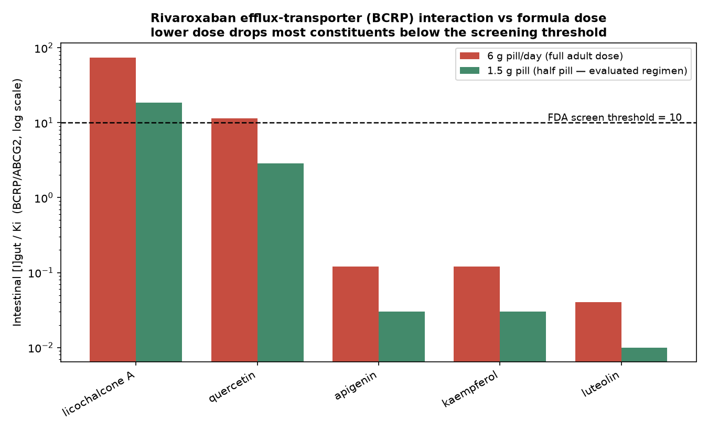

# 附：特定方案定量评估 —— 利伐沙班 10 mg qd + 半粒大黄蛰虫丸(1.5 g 蜜丸)

> 静态机制性 DDI 剂量模型（FDA 2020 [I]/Ki 法）· ChEMBL 实测 Ki + 药典配比 + 文献含量估算
> **本节为科研定量估算，不构成用药建议；存在较大不确定度。**

---

## 直接回答：会“好些”吗？

> **会明显好一些——但“更低风险”不等于“安全/可自行联用”。**
>
> 把方剂降到 **1.5 g 蜜丸（≈0.71 g 生药当量，约为常规日量的 1/4）**、利伐沙班用 **10 mg qd（低强度预防量）**，在定量模型中带来三点实质性改善：
> 1. **药代(PK)相互作用信号大幅下降**：常规全量下 quercetin、licochalcone A 对 **BCRP** 的肠道 [I]/Ki 超阈；**减量到 1.5 g 后 quercetin 跌破阈值**（从 11.5 → 3.0），系统性 CYP3A4/P-gp/BCRP 抑制全部可忽略，仅剩 **licochalcone A** 一个（且其含量高度不确定）仍在阈值上。
> 2. **药效(PD)抗栓负荷更小**：低剂量方剂递送的抗凝/抗血小板活性成分更少，与利伐沙班的叠加更弱。
> 3. **甘草毒性风险很低**：该剂量仅含甘草 ~49 mg、甘草酸 ~1.5 mg，远低于诱发假性醛固酮增多症的 ~100 mg/日阈值。
>
> **但仍有不可忽视的残余风险**：利伐沙班本身抗凝，方中 **水蛭(水蛭素)** 是直接凝血酶抑制剂（本小分子模型未覆盖），**出血风险的叠加方向依旧存在**，且缺乏人体数据。故属 **“风险显著降低但非归零”**，仍需医师监护。

---

## 一、剂量换算与暴露估算

| 项目 | 数值 | 说明 |
|---|---|---|
| 评估丸重 | 1.5 g | 同仁堂大蜜丸 3 g 之半粒 |
| 生药当量 | ~0.71 g | 大蜜丸 生药:蜂蜜≈1:1.1 稀释后 |
| 相当于常规日量 | ~1/4 | 常规成人约 6 g 蜜丸/日(3 g bid) |
| 利伐沙班 | 10 mg qd | 低强度/预防量；吸收~80–100%(不受food影响)，基线出血风险低于 15/20 mg 治疗量 |

肠道浓度按 FDA 法 [I]gut = 递送摩尔量 / 250 mL；系统未结合 Cmax 用低生物利用度黄酮的量级假设估算。

---

## 二、药代动力学(PK)：对利伐沙班清除通路的抑制 [I]/Ki

利伐沙班经 **CYP3A4** 代谢、是 **P-gp/BCRP** 底物。下表为 **1.5 g 剂量** 下各成分的估算：

| 成分 | 递送量(mg) | 肠道[I](µM) | CYP3A4 Igut/Ki | P-gp Igut/Ki | **BCRP Igut/Ki** |
|---|---|---|---|---|---|
| licochalcone A | 0.010 | 0.12 | — | 0.0 | **18.51** ⚠️ |
| quercetin | 0.006 | 0.09 | 0.04 | 0.01 | 2.86 |
| apigenin | 0.006 | 0.10 | 0.08 | 0.01 | 0.03 |
| kaempferol | 0.010 | 0.14 | 0.02 | 0.02 | 0.03 |
| luteolin | 0.006 | 0.09 | 0.02 | 0.0 | 0.01 |

- **超过 FDA 筛查阈值(≥10)者**：1.5 g 剂量下仅 **licochalcone A(ABCG2/BCRP)**；6 g 全量下为 **quercetin(ABCG2/BCRP), licochalcone A(ABCG2/BCRP)**。
- 系统性抑制（1+Cmax_u/Ki）在两种剂量下均 ≈1.0，可忽略——说明 **主要相互作用发生在肠道 BCRP**，且随剂量线性缩放。

> **PK 小结：** 减量到 1.5 g 使 quercetin 等跌破阈值，PK 相互作用从“多点超阈”降为“仅 licochalcone A 一点、且高度不确定”。考虑到 licochalcone A 主要存在于胀果甘草、常规乌拉尔甘草含量极低，**该方案下 PK 层面升高利伐沙班暴露的风险很可能较小**。

---

## 三、药效动力学(PD)：出血风险叠加——模型的关键盲点

**必须强调：** 上述 PK 模型 **未覆盖** 出血风险叠加中最直接的一环——
- **水蛭(制水蛭)中的水蛭素(hirudin)** 是直接凝血酶抑制剂（多肽，不在小分子库中）。1.5 g 蜜丸约含制水蛭 ~32 mg；虽经炮制活性下降，但与利伐沙班(抗 FXa)构成 **双重抗凝**。
- 方中 **quercetin/baicalein 等抗血小板(COX/LOX)** 作用亦随成分递送叠加。
- 利伐沙班 10 mg qd 抗凝作用确定存在。

→ 因此，**即便 PK 相互作用被剂量削弱，PD 层面的抗凝-抗血小板叠加仍使净出血风险高于单用利伐沙班**；只是相较“全量方剂 + 高剂量利伐沙班”，此低剂量组合的叠加幅度更小。

---

## 四、毒理学与其他安全性（该剂量下的量化）

- **甘草/假性醛固酮增多症**：本剂量甘草酸 ~1.5 mg（全量约 5.8 mg），远低于 ~100 mg/日风险阈值 → **该剂量下低风险**（长期每日服用仍需留意累积）。
- **大黄蒽醌(emodin 等)**：单次递送 ~0.16 mg，急性毒性风险低；但 **长期使用** 蒽醌类与肝/肾负担、结肠黑变病、emodin 遗传毒性信号相关，不宜久服。
- **动物药(水蛭/虻虫/蛴螬/土鳖虫)**：破血逐瘀，**孕妇禁用**；过敏体质注意。
- 利伐沙班清除依赖肝肾 → **肝肾功能不全者暴露升高**，与本方联用时风险放大。

---

## 五、结论

| 维度 | 全量方剂 + 高剂量利伐沙班 | **1.5 g 蜜丸 + 利伐沙班 10 mg qd** |
|---|---|---|
| PK(升高暴露) | quercetin+licochalcone A 超阈 | **仅 licochalcone A(不确定)**，显著减轻 |
| PD(出血叠加) | 强 | **较弱但仍存在**(含水蛭素) |
| 甘草毒性 | 需留意 | **低** |
| 总体 | 风险较高 | **风险明显降低，但非归零** |

> **一句话结论：** 用 **利伐沙班 10 mg qd + 半粒(1.5 g)大黄蛰虫丸** 相比高剂量组合 **确实“好一些”**——PK 相互作用大幅减弱、甘草毒性低；但因 **水蛭素等导致的出血叠加方向不变**、且 **无人体证据**，**仍须在专科医师/临床药师监护下、密切监测出血的前提下使用，不能作为自我药疗的安全依据**。

**监测建议**：出血征象(瘀斑/黑便/血尿/Hb)、肝肾功能、（长期服用则查）血钾血压；避免叠加 NSAID/抗血小板药；高出血风险者与孕妇不联用。

---

## 六、方法学局限（务必知悉）

- **成分含量为文献/药典量级估算**，游离苷元 vs 糖苷、licochalcone A 的甘草品种差异等带来 **数量级不确定度**。
- **静态 [I]/Ki 筛查模型 ≠ PBPK 定量预测**；[I]gut 假设 250 mL 溶出、未计溶解度/首过/肠菌代谢(如槲皮素糖苷经肠菌释放苷元)。
- **未定量水蛭素(PD 抗凝)**——出血叠加的主因之一，模型系统性低估 PD 风险。
- 复方成分间相互作用、实际制剂含量未纳入。

> **免责声明：** 本节为计算性科研分析，**不构成医疗建议**。抗凝药与中成药联用请务必咨询专业医师与临床药师并遵循循证指南。
