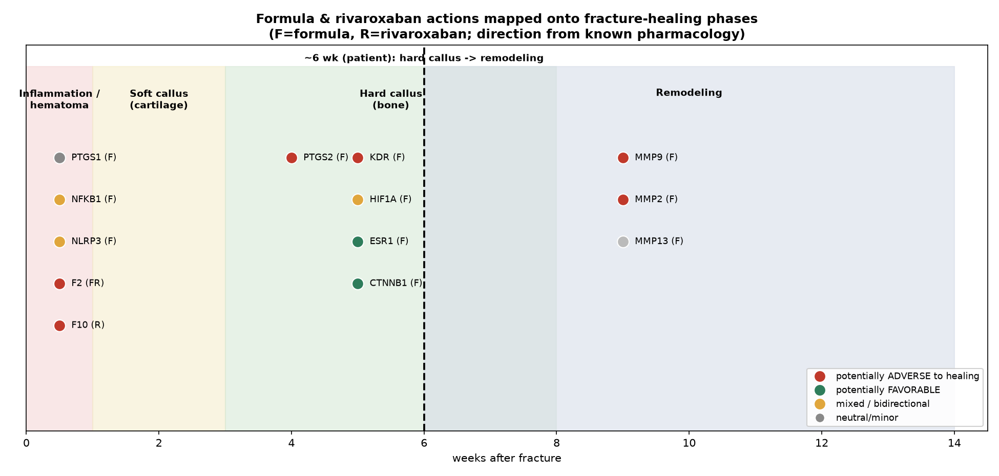

# 附：结合骨折愈合靶点的客观评估（腓骨骨折 ~6 周）

> 数据驱动、方向标注的骨折愈合维度分析 · **客观呈现利弊，非用药建议**
> 本文回答的是“方剂/利伐沙班对**骨愈合**这一维度可能是帮助还是妨碍”，而非“您是否该用”。

---

## 一句话客观结论

> **对“骨折愈合”这一维度，计算显示是一幅“双刃、以潜在不利信号更确凿”的图景**——方剂与 **47 个骨愈合相关基因**重叠；在可判定方向的关键靶点中，**潜在不利 7 个、潜在有利 3 个、双向 2 个**。
>
> **关键：您 6 周处于“骨痂/重塑期”，此期最依赖 血管新生(VEGFR2)、基质重塑(MMP)、COX-2 信号——而方剂恰好抑制这三者**，机制上属较确凿的“可能妨碍此阶段愈合”的信号；其“促成骨”效应(植物雌激素/Wnt)相对较弱且多为体外证据。
>
> **因此，从骨愈合角度，本组合并不能得出“帮助骨折痊愈”的结论；反而存在若干需要正视的潜在不利机制。**（但见下方“剂量与不确定性”——实际影响幅度可能受低暴露限制，须临床判断。）

---

## 一、方剂/利伐沙班作用于骨愈合靶点（含方向）

| 靶点 | 愈合阶段 | 谁作用 | 对骨愈合方向 | 机制说明 |
|---|---|---|---|---|
| **PTGS2** | 炎症→成骨 | 方剂 | ⚠️ 不利 | COX-2 是骨折愈合必需;NSAID样抑制延迟骨愈合 |
| **PTGS1** | 炎症/血肿 | 方剂 | 中性/轻不利 | COX-1 |
| **KDR** | 血管新生 | 方剂 | ⚠️ 潜在不利 | 血管新生对骨痂血运关键;抗VEGFR2或碍血运 |
| **HIF1A** | 血管新生 | 方剂 | 🟡 双向 | 缺氧诱导血管新生;HIF激活利于骨愈合 |
| **MMP9** | 重塑 | 方剂 | ⚠️ 潜在不利 | MMP9缺失延迟骨痂血管化/重塑 |
| **MMP2** | 重塑 | 方剂 | ⚠️ 潜在不利 | 参与骨痂重塑 |
| **MMP13** | 重塑 | 方剂 | — | 软骨/骨重塑主力胶原酶 |
| **NFKB1** | 炎症/血肿 | 方剂 | 🟡 双向 | 过度炎症有害,但早期炎症必需 |
| **NLRP3** | 炎症/血肿 | 方剂 | 🟡 偏有利 | 抑制过度炎症小体或利后期愈合 |
| **ESR1** | 成骨/硬骨痂 | 方剂 | 🟢 潜在有利 | 雌激素信号促成骨/抗骨丢失 |
| **CTNNB1** | 成骨/硬骨痂 | 方剂 | 🟢 潜在有利 | Wnt通路促成骨 |
| **F2** | 凝血支架 | 方剂+利伐沙班 | ⚠️ 早期不利/现阶段影响小 | 凝血酶参与早期血肿支架;6周已过血肿期 |
| **F10** | 凝血支架 | +利伐沙班 | ⚠️ 早期不利/现阶段影响小 | 抗凝影响早期血肿;6周影响较小 |

---

## 二、潜在不利信号（值得正视，机制较确凿）

1. **COX-2 抑制（PTGS2）——证据最强的顾虑。** COX-2 是骨折愈合所必需；**NSAID 类 COX 抑制剂已被大量研究证实可延迟/影响骨折愈合**。方中 quercetin/apigenin 抑制 PTGS2 → 机制上同向。
2. **抗血管新生（KDR/VEGFR2）。** 骨痂再血管化对愈合关键；黄酮(quercetin)是 VEGFR2 抑制剂 → 理论上不利于此期血运。
3. **抑制基质金属蛋白酶（MMP2/9）。** MMP 参与骨痂重塑与血管化，MMP9 缺失动物骨愈合延迟；方中 isoliquiritigenin 强效抑制 → 理论上不利于**您当前的重塑期**。
4. **抗凝对早期血肿（F2/F10）。** 凝血酶/纤维蛋白血肿是早期愈合支架；利伐沙班+方剂(水蛭素)抗凝理论上不利，但**6 周已过血肿期，此项现阶段影响较小**。

## 三、潜在有利信号（较弱/多为体外）

1. **植物雌激素样(ESR1)** 与 **Wnt/β-catenin(CTNNB1)**：黄酮(quercetin/kaempferol/baicalein)有促成骨、抗骨丢失的体外/动物报道。
2. **抑制过度炎症(NLRP3)**：后期减轻慢性炎症或利愈合。
3. **中医传统**：活血化瘀在骨折中期常用于改善局部血运、消肿——但 **大黄蛰虫丸为峻猛破血之剂，非典型接骨方**，是否对证须中医辨证。

---

## 四、剂量与不确定性（务必平衡看待）

- 本项目 PBPK 已显示：半粒蜜丸递送的黄酮为 **µg 级、系统暴露极低**（对利伐沙班 AUC 仅 +3%）。**同理，这些黄酮对骨的系统性抗血管/抗 MMP/抗 COX 作用，实际幅度也可能被低暴露所限**——即“不利信号”未必转化为明显的临床骨愈合损害。
- 网络药理学靶点表 **不含剂量与体内方向确证**；上述“方向”来自已知药理，属 **理论机制层面**，需实验/临床验证。
- 因此客观表述是：**“机制上存在若干对重塑期不利的信号，且不支持‘促进骨折愈合’；但实际影响幅度不确定、可能有限。”** 既不夸大有害，也不宜宣称有益。

---

## 五、客观小结

| 维度 | 客观判断 |
|---|---|
| 对骨折愈合“有帮助”? | **证据不支持**；促成骨信号较弱且体外为主 |
| 对骨折愈合“有妨碍”? | **存在较确凿的机制性顾虑**（COX-2、VEGFR2、MMP 抑制，且正落在您的重塑期）|
| 实际幅度 | **不确定**，可能受 µg 级低暴露限制 |
| 与出血/前述结论的关系 | 叠加“出血风险增加(PD)”一并考量 → **审慎** |

> **客观结论：** 结合骨折愈合靶点后，**没有数据支持“该组合能促进腓骨骨折痊愈”**；相反，在您所处的 **6 周重塑期**，方剂对 **COX-2、血管新生、MMP 重塑** 的抑制构成 **机制上需正视的潜在不利**（幅度不确定）。这一维度**进一步支持“需骨科/临床医师个体化评估、不宜自行联用”**的结论。

> **免责声明：** 本节为计算性科研分析，**不构成诊断或治疗建议**。是否用药、如何促进骨折愈合，请以骨科医生与中医师面诊评估为准。
