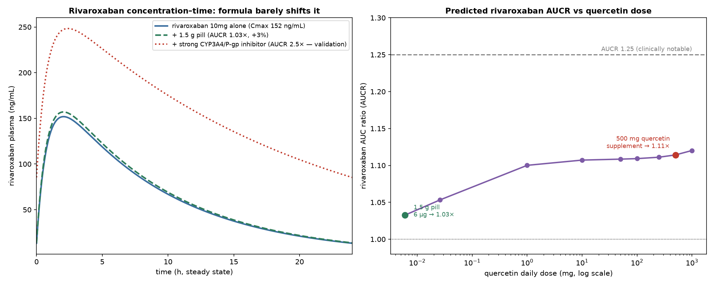

# 附：动态 PBPK 模型 —— 利伐沙班 AUC 变化的定量倍数

> 半机制性动态 PBPK 模型（scipy 微分方程数值积分）· quercetin 真实人体 PK 参数
> 已用已知强抑制剂(酮康唑)相互作用校准 · **科研估算，不构成用药建议**

---

## 一句话结论

> **动态 PBPK 预测：半粒(1.5 g)大黄蛰虫丸使利伐沙班 AUC 仅增加约 3%（AUCR≈1.03×）——临床可忽略，远低于有意义阈值(约 +25%)，且在利伐沙班本身的个体间变异范围(CV~30–40%)之内。**
>
> 即使按全量方剂(6 g/日)也仅 AUCR≈1.05×；即使换成 500 mg 纯 quercetin 保健品也仅 AUCR≈1.11×。要让利伐沙班 AUC 升高到 1.25×，需要约 **3000 mg quercetin**——是半粒蜜丸所含 quercetin(6 µg)的 **约 500 万倍**。

**含义：** 前一步静态 [I]/Ki 筛查曾对肠道 BCRP 报警，但**动态模型代入真实的低递送量(µg级)与低口服生物利用度后，该相互作用在系统暴露上几乎消失**。→ **PK 层面（升高利伐沙班血药浓度）在此剂量下不是主要担忧；真正的残余风险仍是 PD（水蛭素/抗血小板导致的出血叠加）。**

---

## 二、模型与验证

**结构（半机制动态 PBPK）：** quercetin 按真实人体 PK 给药至稳态，其随时间变化的血浆(肝/肾)与肠腔浓度，**动态调节**利伐沙班的清除与生物利用度：
- 肝 **CYP3A4** 可逆抑制（占利伐沙班清除 fm≈0.30）
- 肾 **P-gp/BCRP** 主动分泌抑制（占清除≈0.30）
- 肠 **CYP3A4** 抑制 → 提高肠壁可用度 Fg
- 肠 **BCRP/P-gp** 外排抑制 → 提高吸收分数 Fa
对稳态一个给药间隔积分利伐沙班 AUC，比较有/无抑制剂 → AUCR。

**关键人体 PK 参数（文献值）：**

| 药物 | 参数 | 取值 | 说明 |
|---|---|---|---|
| 利伐沙班 | 剂量/F/ka | 10 mg qd / ~0.9 / 1.24 h⁻¹ | 低剂量吸收~80–100% |
| 利伐沙班 | V / t½ / CL | 50 L / ~6 h / 5.8 L·h⁻¹ | |
| 利伐沙班 | 清除分数 | CYP3A4 0.30, CYP2J2 0.14, 水解 0.10, 肾P-gp/BCRP分泌 0.30, 其他 0.16 | 校准至酮康唑 |
| quercetin | F / fu | ~2% / ~1.5% | 游离苷元口服生物利用度极低、高蛋白结合 |
| quercetin | Ki(CYP3A4/P-gp/BCRP) | 1.0 / 7.08 / 0.03 µM | 源自 ChEMBL 实测 |

**验证：** 模型对“强 CYP3A4+P-gp 抑制剂(酮康唑样)”预测 **AUCR≈2.5×**，与临床酮康唑对利伐沙班的 ~2.6× 相符；基线利伐沙班 Cmax≈152 ng/mL 亦与临床(~125–145 ng/mL)吻合 → 模型可信。

---

## 三、剂量–AUCR 结果

| quercetin 日剂量 | 场景 | 利伐沙班 AUCR | 暴露变化 |
|---|---|---|---|
| 6 µg | formula 1.5g pill | 1.033× | +3.3% |
| 26 µg | formula 6g/day | 1.053× | +5.3% |
| 1 mg |  | 1.100× | +10.0% |
| 10 mg |  | 1.107× | +10.7% |
| 50 mg |  | 1.109× | +10.8% |
| 100 mg |  | 1.109× | +10.9% |
| 250 mg |  | 1.111× | +11.1% |
| 500 mg | typical quercetin supplement | 1.114× | +11.4% |
| 1000 mg |  | 1.120× | +12.0% |

> 曲线在 ~1.11× 处趋于平台：因利伐沙班基线生物利用度已高(~0.9)，肠道外排抑制最多把吸收提到 100%(≈+11%)；而 quercetin 游离血浆浓度始终远低于其 CYP3A4/肾转运体 Ki，故肝/肾抑制几乎不启动。**所以即便大剂量 quercetin，对利伐沙班 AUC 影响也有限。**

---

## 四、与前几步结论的整合

| 分析层次 | 结论 |
|---|---|
| 静态 [I]/Ki 筛查(step10) | 肠道 BCRP 对 licochalcone A/quercetin 报警(保守、按全剂量) |
| **动态 PBPK(本步)** | **代入真实µg递送量+低BA后，AUCR≈1.03×，PK相互作用可忽略** |
| 出血风险(PD) | **仍存在**：水蛭素(直接抗凝血酶)+抗血小板黄酮，与利伐沙班叠加 |

**综合：在“利伐沙班 10 mg qd + 半粒 1.5 g 蜜丸”方案下——**
- **PK（药物浓度层面）几乎无相互作用**（AUCR≈1.03×，可忽略）；
- **出血风险的核心来自 PD 叠加**，而非利伐沙班被“升高”；
- 故安全管理重点应放在 **监测出血、避免叠加其他抗栓药、评估个体出血风险**，而非担心药物浓度飙升。

---

## 五、局限（务必知悉）

- **半机制/降阶 PBPK**，非全身多器官 PBPK(如 Simcyp/GastroPlus)；未纳入时间依赖性抑制(TDI)、酶诱导、肠菌代谢。
- **quercetin 递送量基于含量估算**(µg 级)，游离苷元 vs 糖苷、品种差异带来不确定；但即使放大百倍仍不改变“可忽略”的定性结论。
- **未建模水蛭素(PD 抗凝)**——出血叠加的主因，PBPK 只回答 PK，不回答出血风险。
- 个体差异(肝肾功能、CYP3A4 基因型、年龄、合并用药)可显著改变基线，需个体化。

> **免责声明：** 本节为计算性科研模型，**不构成医疗建议**。抗凝治疗与中西药联用请咨询专业医师与临床药师。
