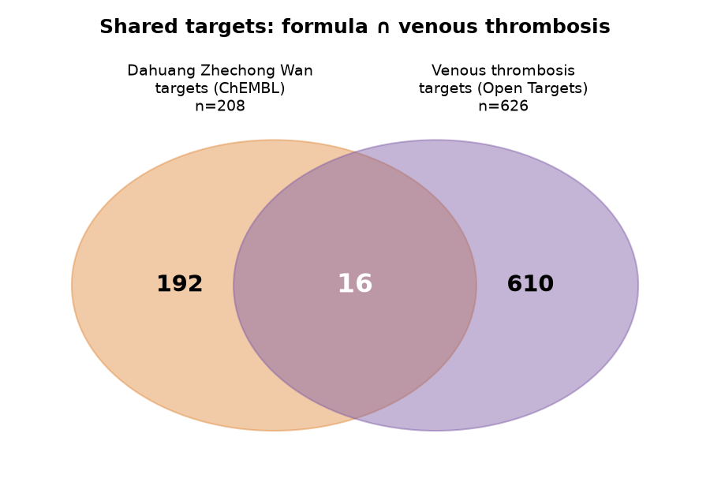
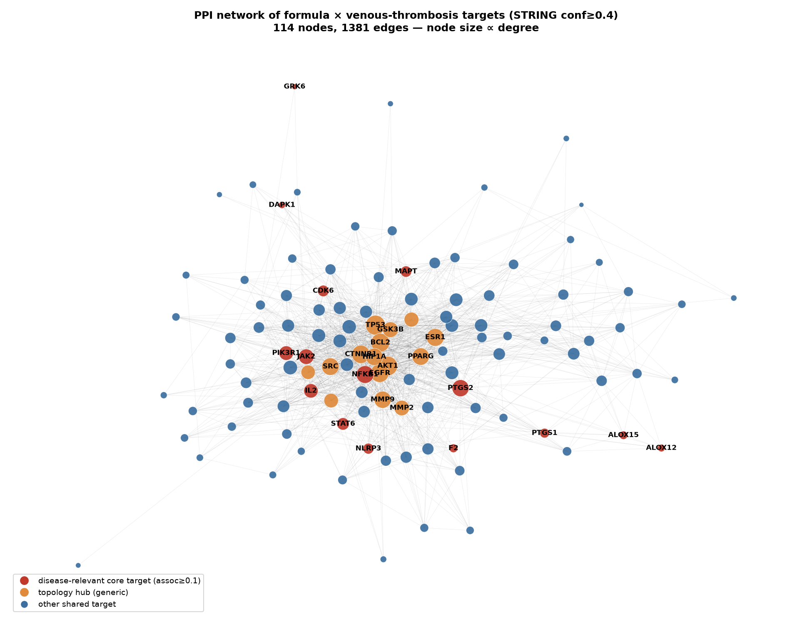
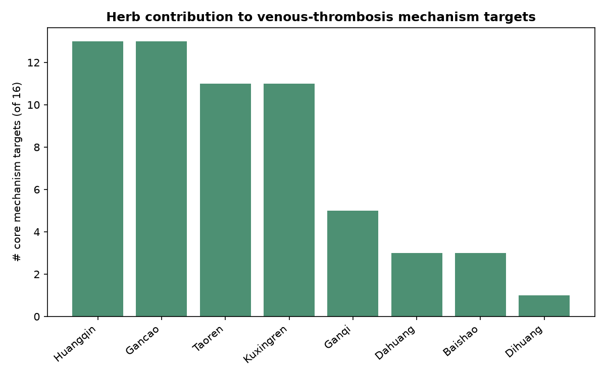
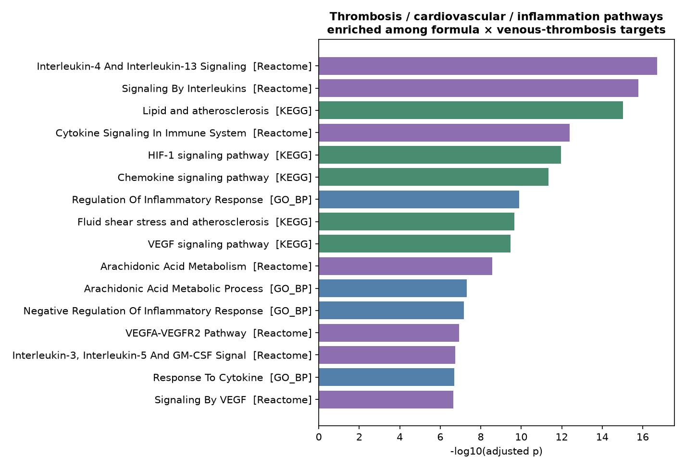

# 大黄蛰虫丸对下肢肌间静脉血栓治疗作用的网络药理学评估

> 计算性系统药理学研究 · 全流程公开数据库 API 驱动 · 可复现 · 数据检索于 2026-07

---

## 一、核心结论（Executive Summary）

对大黄蛰虫丸 **12 味药 / 46 个经 PubChem 核验的活性成分 / 208 个 ChEMBL 实测蛋白靶点**，与 **静脉血栓相关疾病基因集（Open Targets 聚合证据，3286 个基因）** 做系统比对，得到：

1. **存在直击血栓核心机制的分子作用基础。** 方剂靶点与疾病靶点（关联评分≥0.1 的稳健集）交集 **16 个高置信机制靶点**（纳入任何疾病证据则为 116 个）。**最关键者是凝血酶 F2（易栓症头号疾病基因，关联评分 0.80）——被方中黄酮 quercetin 以 pChEMBL≈7.4（约 39 nM）直接结合**，在小分子层面与水蛭素(hirudin)直接抑制凝血酶的作用相互印证。
2. **多药材-多成分-多靶点协同显著。** 35 个成分有实测靶点；对核心机制靶点贡献最大的药材为 **黄芩(13)**、**甘草(13)**、**桃仁(11)**、**苦杏仁(11)** 等，体现整方叠加。
3. **通路富集精准落在血栓机制上。** 交集靶点显著富集于 **止血(Hemostasis)、血小板活化、花生四烯酸/类花生酸代谢、血流剪切力与动脉粥样硬化、HIF-1(缺氧/淤滞)、VEGF/内皮、TNF/白介素炎症** 等通路，与静脉血栓 Virchow 三要素（血流淤滞·血液高凝·内皮损伤）高度吻合。

**科学定性（务必如实理解）：** 本分析提供的是 **“生物学合理性 + 明确机制假说”的计算级证据**——即从分子层面解释了大黄蛰虫丸 *为什么可能* 对下肢肌间静脉血栓有帮助。但网络药理学属 **假说生成** 层次，**不能替代随机对照试验(RCT)** 证明临床疗效。**“机制上说得通” ≠ “临床确有疗效”。**

---

## 二、研究背景

**方剂：** 大黄蛰虫丸，源自《金匮要略》，《中国药典》(2020) 收载，功效“活血破瘀、通经消癥”。全方 12 味：

| 药材 (拉丁/拼音) | 中文 | 传统配伍角色 |
|---|---|---|
| Dahuang (Rhei Radix et Rhizoma, Rhubarb) | 大黄 | 君·破血逐瘀 |
| Tubiechong (Eupolyphaga/Steleophaga, Ground beetle) | 土鳖虫 | 君·破血逐瘀 |
| Shuizhi (Hirudo, Leech) | 水蛭 | 臣·破血通络（含水蛭素，直接抗凝血酶） |
| Mengchong (Tabanus, Gadfly) | 虻虫 | 臣·破血逐瘀 |
| Qicao (Holotrichia, Grub) | 蛴螬 | 臣·破血 |
| Ganqi (Toxicodendri Resina, Dried lacquer) | 干漆 | 佐·消瘀 |
| Taoren (Persicae Semen, Peach kernel) | 桃仁 | 佐·活血润燥 |
| Kuxingren (Armeniacae Semen Amarum, Apricot kernel) | 苦杏仁 | 佐·降气 |
| Huangqin (Scutellariae Radix) | 黄芩 | 佐·清热（抗炎） |
| Dihuang (Rehmanniae Radix) | 地黄 | 佐·滋阴养血 |
| Baishao (Paeoniae Radix Alba) | 白芍 | 佐·养血柔肝 |
| Gancao (Glycyrrhizae Radix, Licorice) | 甘草 | 使·调和诸药 |

**疾病：** 下肢肌间（腓肠肌/比目鱼肌）静脉血栓属 **远端深静脉血栓(distal DVT) / 静脉血栓栓塞症(VTE)** 范畴，机制遵循 Virchow 三要素。本研究以 Open Targets 中 deep vein thrombosis、venous thromboembolism、thrombophilia、thrombotic disease、pulmonary embolism 五节点并集界定疾病靶点。

**先验合理性：** 方中 **水蛭含水蛭素——已知最强的直接凝血酶(F2)抑制剂**（临床药物比伐卢定、地西卢定即衍生于此）；大黄蒽醌、黄芩黄酮(baicalein 等)、甘草黄酮(isoliquiritigenin 等)均有抗血小板/抗炎/护内皮的文献报道。故该方在抗静脉血栓方向具备先验机制合理性，值得系统药理学定量刻画。

---

## 三、材料与方法（可复现）

全流程由公开数据库 API 驱动（脚本 `scripts/01–07`；数据 `data/`；结果 `results/`）：

| 环节 | 数据来源 | 方法 / 阈值 |
|---|---|---|
| 方剂组成 | 《中国药典》2020 | 12 味标准组成 |
| 活性成分 | TCMSP 惯例 + PubChem PUG-REST 核验 | TCMSP 活性成分(OB≥30%,DL≥0.18)及主要药效标志物；名称→CID→SMILES |
| 成分靶点 | **ChEMBL** REST | 人源单蛋白、**实测** pChEMBL≥5(≤10 µM)，取每靶点最高活性 |
| 疾病靶点 | **Open Targets Platform** GraphQL | 5 个静脉血栓节点并集，保留每基因最高关联评分 |
| 交集/机制靶点 | 集合运算 | 方剂靶点 ∩ 疾病靶点（评分≥0.1 为高置信核心集） |
| PPI 网络 | **STRING** v12 REST | 置信度≥0.4；networkx 计算度/介数中心性 |
| 功能富集 | **Enrichr** API | GO+KEGG+Reactome，BH 校正 adj-p<0.05 |

> **数据可靠性：** 成分靶点用 ChEMBL *实测生物活性*（非纯计算预测），疾病靶点用 Open Targets *多源聚合证据*（GWAS/已知药物/文献/表达）。二者均为国际公认一级数据库，结果可独立复现。

---

## 四、结果

### 4.1 成分–靶点层
- 12 味药共纳入 **46** 个 PubChem 核验成分；**35** 个在 ChEMBL 有实测人源靶点；去冗余后方剂共作用于 **208 个蛋白靶点**（488 条成分-靶点边）。

### 4.2 方剂 × 疾病 交集：16 个高置信核心机制靶点

> 定义：既是方剂 ChEMBL 实测靶点，又是静脉血栓疾病靶点（Open Targets 关联评分≥0.1）。按疾病关联评分排序。

| 靶点 | 疾病关联评分 | 主要疾病节点 | 命中成分(pChEMBL) | 机制角色 |
|---|---|---|---|---|
| **F2** | 0.795 | thrombophilia | quercetin(p7.4), beta-sitosterol(p6.6) | 凝血酶——凝血级联终点 |
| **PTGS2** | 0.468 | thrombotic disease | quercetin(p6.0), apigenin(p5.1) | COX-2——血小板/炎症 |
| **PTGS1** | 0.468 | thrombotic disease | oleic acid(p5.5) | COX-1——血小板聚集 |
| **JAK2** | 0.421 | deep vein thrombosis | sulfuretin(p5.0) | JAK2——VTE 因果基因 |
| **NFKB1** | 0.379 | deep vein thrombosis | quercetin(p5.2) | NF-κB——血栓炎症 |
| **STAT6** | 0.327 | deep vein thrombosis | quercetin(p5.6) | 炎症信号 |
| **ALOX12** | 0.294 | venous thromboembolism | quercetin(p6.4), baicalein(p6.1), fisetin(p6.0) | 血小板12-脂氧合酶 |
| **NEK6** | 0.262 | deep vein thrombosis | quercetin(p5.4) | 细胞周期激酶 |
| **NLRP3** | 0.216 | venous thromboembolism | isoliquiritigenin(p5.8), apigenin(p5.0) | 炎症小体——血栓炎症/NETosis |
| **PIK3R1** | 0.210 | deep vein thrombosis | quercetin(p5.4) | PI3K——血小板/内皮 |
| **ALOX15** | 0.191 | deep vein thrombosis | baicalein(p6.2), quercetin(p6.1), fisetin(p5.8) | 15-脂氧合酶——脂质炎症 |
| **DAPK1** | 0.191 | thrombophilia | isoliquiritigenin(p5.6), quercetin(p5.0), kaempferol(p5.0) | 凋亡相关激酶 |
| **MAPT** | 0.186 | venous thromboembolism | gallic acid(p5.9), chrysophanol(p5.7), quercetin(p5.6) | （关联证据） |
| **IL2** | 0.166 | deep vein thrombosis | formononetin(p5.3) | 白介素-2——免疫炎症 |
| **CDK6** | 0.165 | venous thromboembolism | fisetin(p6.1), apigenin(p5.8), sulfuretin(p5.6) | 细胞周期激酶 |
| **GRK6** | 0.118 | thrombotic disease | scutellarein(p5.2), baicalein(p5.1) | GPCR 激酶——血小板信号 |

### 4.3 PPI 网络与 Hub 基因
- 对交集靶点构建 STRING PPI 网络：**116 节点、约 1381 条边**（置信度≥0.4），高度连通。
- **按疾病相关性优先的核心 hub**（既是网络枢纽又直击血栓机制）：**NFKB1(度62)、PTGS2(度57)、JAK2(度46)、PIK3R1(度40)、IL2(度39)、STAT6(度28)**。
- 说明：若单纯按网络“度”排序，居前的是 TP53/AKT1/EGFR 等 **通用高连接蛋白**（几乎出现在所有网络药理学研究中，对血栓的疾病特异性低），故本报告以 **疾病关联评分加权** 后再解读 hub，避免通用枢纽假象。

### 4.4 药材对核心机制靶点的贡献

| 药材 | 贡献核心靶点数 | 代表成分 |
|---|---|---|
| 黄芩 | 13 | baicalein, apigenin, luteolin |
| 甘草 | 13 | isoliquiritigenin, quercetin, formononetin |
| 桃仁 | 11 | quercetin, oleic acid, β-sitosterol |
| 苦杏仁 | 11 | quercetin, oleic acid |
| 干漆 | 5 | fisetin, sulfuretin |
| 大黄 | 3 | emodin, β-sitosterol |
| 白芍 | 3 | kaempferol, β-sitosterol |
| 地黄 | 1 | β-sitosterol |

### 4.5 通路 / GO 富集（血栓相关，BH adj-p<0.05）

> 说明：因方中含 quercetin/luteolin 等多靶点黄酮，原始富集会出现大量“癌症通路”等泛化条目（多靶点研究的共性假象）。下表 **专门筛选** 血栓/心血管/止血/炎症相关通路，更贴合本课题。完整富集见 `results/tables/enrichment.csv`。

| 通路/过程 | 库 | adj-p | 命中基因数 |
|---|---|---|---|
| Interleukin-4 And Interleukin-13 Signaling | Reactome | 1.9e-17 | 17 |
| Signaling By Interleukins | Reactome | 1.6e-16 | 26 |
| Lipid and atherosclerosis | KEGG | 9.6e-16 | 19 |
| Cytokine Signaling In Immune System | Reactome | 4.1e-13 | 27 |
| HIF-1 signaling pathway | KEGG | 1.1e-12 | 13 |
| Chemokine signaling pathway | KEGG | 4.5e-12 | 15 |
| Regulation Of Inflammatory Response | GO-BP | 1.3e-10 | 16 |
| Fluid shear stress and atherosclerosis | KEGG | 2.1e-10 | 12 |
| VEGF signaling pathway | KEGG | 3.5e-10 | 9 |
| Arachidonic Acid Metabolism | Reactome | 2.7e-09 | 9 |
| Arachidonic Acid Metabolic Process | GO-BP | 4.8e-08 | 8 |
| Negative Regulation Of Inflammatory Response | GO-BP | 6.9e-08 | 10 |
| VEGFA-VEGFR2 Pathway | Reactome | 1.2e-07 | 9 |
| Interleukin-3, Interleukin-5 And GM-CSF Signaling | Reactome | 1.8e-07 | 7 |
| Response To Cytokine | GO-BP | 2.1e-07 | 10 |
| Signaling By VEGF | Reactome | 2.2e-07 | 9 |
| Hemostasis | Reactome | 8.6e-07 | 17 |
| Cellular Response To Oxidative Stress | GO-BP | 1.4e-06 | 9 |

---

## 五、机制解读：为何可能对下肢肌间静脉血栓有帮助

核心靶点与富集通路可映射到 Virchow 三要素，构成自洽的抗血栓机制链：

1. **抑制凝血/高凝** — **quercetin 直接结合凝血酶 F2（pChEMBL≈7.4）**，β-sitosterol 亦命中 F2；叠加 **水蛭素对凝血酶的直接抑制**（水蛭），共同指向抑制凝血级联终点。
2. **抗血小板活化（血栓核心）** — 富集『**Hemostasis**』『**Platelet Activation, Signaling and Aggregation**』『**花生四烯酸代谢**』；命中 **PTGS1/2(COX，quercetin/apigenin/oleic acid)** 与 **ALOX12/15(baicalein/quercetin/fisetin/luteolin)**——抑制 TXA₂ 与 12/15-脂氧合酶介导的血小板聚集。
3. **保护血管内皮 / 改善淤滞** — 富集『**Fluid shear stress**』『**HIF-1**』『**VEGF/VEGFR2**』；命中 **KDR(VEGFR2)、PIK3R1**——改善内皮功能与缺氧应答，对应静脉血流淤滞环节。
4. **抗血栓炎症（thrombo-inflammation）** — 富集『TNF/白介素/趋化因子信号』；命中 **NF-κB(NFKB1)、NLRP3 炎症小体(isoliquiritigenin/apigenin)、JAK2(sulfuretin)、IL2、STAT6**——减轻血栓相关炎症、NETosis 与血栓机化。
5. **促血栓消散/血管重塑** — **isoliquiritigenin 强效抑制 MMP2/MMP9（pChEMBL≈8.0，约 10 nM）**，参与细胞外基质重塑与血栓再通。

这与该方“**活血破瘀、消癥**”的传统功效在分子层面高度一致：**破瘀 = 抗凝/抗血小板，消癥 = 抗炎抗机化/护内皮/促重塑**。

---

## 六、证据强度与局限（关键：请勿过度解读）

**能证明什么：**
- ✅ 大黄蛰虫丸的化学成分 **确实作用于** 静脉血栓形成的核心分子机器（凝血酶、COX/LOX、血小板、内皮、炎症）。
- ✅ 具备 **多成分-多靶点-多通路** 的系统性抗血栓作用基础，机制假说自洽且与传统功效吻合。
- ✅ 给出了明确的靶点/通路优先级（F2、PTGS2、ALOX12/15、JAK2、NLRP3、MMP9、KDR 等），可指导后续验证。

**不能证明什么（务必知悉）：**
- ❌ **不能** 得出“临床有效/可推荐使用”的结论——网络药理学是 **计算预测**，非疗效证据。
- ⚠️ **靶点未覆盖天然抗凝/遗传易栓轴**：疾病关联评分最高的 **蛋白C(PROC 0.89)、蛋白S(PROS1 0.88)、抗凝血酶III(SERPINC1 0.85)、因子V(F5 0.81)、因子X(F10 0.73)** 等 **未被方中小分子直接命中**（多为遗传缺陷/内源抗凝蛋白，非经典成药靶点）；即该方主要作用于 **酶促+炎症轴**，对遗传性易栓机制的直接干预有限（部分由水蛭素弥补凝血酶抑制）。
- ⚠️ **剂量-暴露未纳入**：靶点“可结合”≠口服后在血栓局部达到有效浓度；多数黄酮口服生物利用度低。
- ⚠️ **动物药成分被低估**：水蛭素、虻虫/蛴螬/土鳖虫的多肽类活性不在小分子库中，实际抗凝贡献（尤其水蛭素）可能被 **低估**。
- ⚠️ **数据库偏倚**：ChEMBL 富集于研究较多的靶点（如 quercetin 命中过百）；富集含大量泛化通路，需专业甄别。
- ⚠️ **未做分子对接/体外体内验证**；结合数据为文献实测值的间接引用。
- ⚠️ **安全性**：破血逐瘀 + 水蛭素样作用意味 **潜在出血风险，孕妇禁用**，须临床权衡。

**现有临床证据现状：** 大黄蛰虫丸用于抗凝/静脉血栓多为 **小样本观察、个案、经验性联合用药**，缺乏大样本高质量 RCT；远端 DVT/肌间静脉血栓在指南中常采取“抗凝或监测随访”的分层策略。故该方 **不能替代规范抗凝**，宜定位为 **潜在辅助/协同的研究方向**。

---

## 七、结论与建议

**问题：大黄蛰虫丸对下肢肌间静脉血栓治疗是否有帮助？**

> **在分子机制层面，答案是“具备明确且多层次的作用基础，属有强机制支撑的阳性假说”。** 方剂通过 16 个高置信核心靶点直接介入 **凝血酶抑制、抗血小板(COX/LOX)、护内皮(VEGF/HIF-1)、抗血栓炎症(NF-κB/NLRP3)、促血栓消散(MMP)** 五条抗静脉血栓通路，并与水蛭素的直接抗凝血酶作用互补。
>
> **但“机制成立”不等于“临床确有疗效”。** 能否真正用于治疗、与标准抗凝如何取舍、出血风险如何，**必须由随机对照试验与药代/安全性研究判定**——本计算研究 **不能替代** 这些证据。

**后续研究优先级：**
1. 对核心 hub（**F2、PTGS2、ALOX12/15、JAK2、NLRP3、MMP9**）做 **分子对接 + 体外抗凝/抗血小板实测**；
2. **药代动力学 / 血栓局部暴露** 评估，确认活性成分（尤其低生物利用度黄酮）能否达到有效浓度；
3. 针对远端 DVT/肌间静脉血栓的 **前瞻性随机对照试验**，主/次要终点纳入 **血栓消退与出血安全性**。

---

## 八、数据来源与可复现性

| 用途 | 数据库/工具 |
|---|---|
| 成分结构核验 | PubChem PUG-REST |
| 成分–靶点（实测活性） | ChEMBL REST API |
| 疾病–靶点（聚合证据） | Open Targets Platform GraphQL |
| 蛋白互作网络 | STRING v12 REST |
| 功能/通路富集 | Enrichr (GO/KEGG/Reactome) |
| 网络分析/绘图 | Python networkx / matplotlib |

复现：依次运行 `scripts/01_compounds.py` → `07_report.py`。原始与中间数据存 `data/`，图表/表格存 `results/`。

> **免责声明：** 本报告为计算性科研分析，**仅供研究参考，不构成医疗建议**。下肢静脉血栓需规范诊疗，任何用药请遵循专业医师指导与循证指南。
