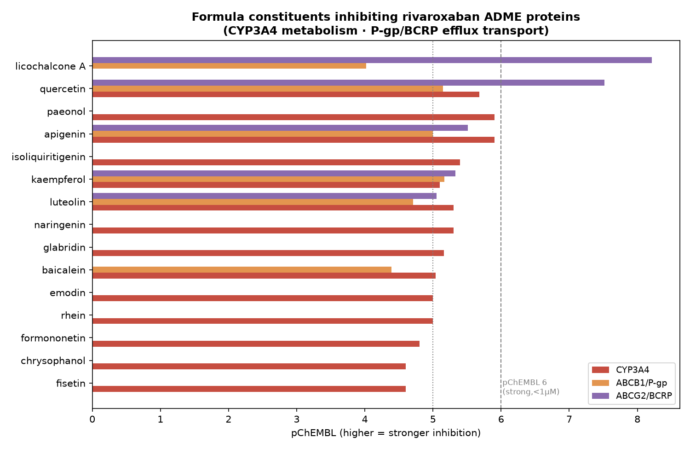

# 附：大黄蛰虫丸 与 利伐沙班(Rivaroxaban) 联用分析

> 药物相互作用(DDI)计算评估 · 数据源 ChEMBL 实测活性 + 利伐沙班已知 ADME 特性
> **本节为科研机制分析，不构成用药建议；联用决策须由临床医师个体化判断。**

---

> 📌 **具体剂量方案**（利伐沙班 10 mg qd + 半粒 1.5 g 蜜丸）的定量估算见 [`DOSE_REGIMEN_DDI.md`](DOSE_REGIMEN_DDI.md)。

## 结论先行

> **不建议在无专科医师监护下自行将大黄蛰虫丸与利伐沙班联用。** 计算证据显示二者存在 **双重相互作用风险**：
> 1. **药效学(PD)——出血风险叠加**：利伐沙班抑制 Xa 因子，方剂命中 **凝血酶 F2、血小板 COX(PTGS1/2)、脂氧合酶 ALOX12/15**，并含 **水蛭素(直接抗凝血酶)**——二者作用于 **同一止血系统的不同环节**，抗凝作用叠加。
> 2. **药代动力学(PK)——升高利伐沙班血药浓度**：利伐沙班经 **CYP3A4** 代谢、是 **P-gp/BCRP** 底物；方中 **quercetin、licochalcone A、apigenin、kaempferol、luteolin** 等对这些酶/转运体有实测抑制作用，尤其 **quercetin 同时抑制 CYP3A4 + P-gp + BCRP**——正是利伐沙班说明书警示会 **增加暴露量与出血风险** 的模式。
>
> **净效应：出血风险很可能升高。** 若临床确需联用，须严密监测出血、评估肝肾功能，并知悉 **目前无 RCT/临床药代研究证实其安全性**。

---

## 一、利伐沙班药理背景

| 属性 | 内容 |
|---|---|
| 药理类别 | 口服直接 **Xa 因子(FXa/F10)** 抑制剂 (DOAC) |
| 代谢 | ~1/2 经肝 **CYP3A4/3A5、CYP2J2** 及 CYP 非依赖水解；~1/3 经肾以原形排泄 |
| 转运体 | **P-糖蛋白(P-gp/ABCB1)** 与 **BCRP(ABCG2)** 底物 |
| 关键 DDI | **CYP3A4+P-gp 联合强抑制剂**(如唑类抗真菌、利托那韦)→暴露↑→出血；强诱导剂(利福平、圣约翰草)→暴露↓→血栓 |
| 出血叠加 | 与其他抗凝/抗血小板/NSAID/影响止血的药物合用→出血风险↑ |

---

## 二、药效学(PD)相互作用：抗凝/抗血小板作用叠加

利伐沙班的靶点是 **Xa 因子(F10)**。分析显示方中小分子 **未直接命中 F10**（非同一位点竞争），但命中凝血级联下游与血小板通路的多个靶点，与利伐沙班形成 **对止血系统的多点联合抑制**：

| 方剂命中靶点 | 作用 | 与利伐沙班的关系 |
|---|---|---|
| **F2** | 凝血酶——凝血级联终点 | 利伐沙班抑制其上游 FXa；本方抑制下游/血小板 → **序贯叠加** |
| **PTGS1** | COX-1——血小板聚集 | 利伐沙班抑制其上游 FXa；本方抑制下游/血小板 → **序贯叠加** |
| **PTGS2** | COX-2——血小板/炎症 | 利伐沙班抑制其上游 FXa；本方抑制下游/血小板 → **序贯叠加** |
| **ALOX12** | 12-脂氧合酶——血小板活化 | 利伐沙班抑制其上游 FXa；本方抑制下游/血小板 → **序贯叠加** |
| **ALOX15** | 15-脂氧合酶——脂质炎症 | 利伐沙班抑制其上游 FXa；本方抑制下游/血小板 → **序贯叠加** |

此外，方中 **水蛭(水蛭素 hirudin)** 是 **直接凝血酶抑制剂**，与利伐沙班(抗 FXa)构成 **双重抗凝**——类似“FXa 抑制剂 + 凝血酶抑制剂”联用，抗凝强度显著增强，**出血风险相应升高**。

> **PD 小结：** 联用 = 利伐沙班(抗 FXa) + 本方(抗凝血酶/抗血小板/纤溶) → **抗凝-抗栓作用叠加，出血风险升高**。这与中医“破血逐瘀”方剂 + 抗凝西药联用需警惕出血的临床共识一致。

---

## 三、药代动力学(PK)相互作用：可能升高利伐沙班暴露量

利伐沙班的清除依赖 **CYP3A4**(代谢) 与 **P-gp / BCRP**(外排转运)。下表为方中成分对这些蛋白的 **ChEMBL 实测抑制活性**（pChEMBL 越高抑制越强；≥6 强、5–6 中等、<5 弱）：

**CYP3A4**（主要代谢酶——抑制→利伐沙班代谢减慢→血药浓度↑）

| 成分 | pChEMBL | 强度 | 实测值 |
|---|---|---|---|
| paeonol | 5.9 | moderate(1-10µM) | Potency=1258.9nM |
| apigenin | 5.9 | moderate(1-10µM) | Potency=1258.9nM |
| quercetin | 5.68 | moderate(1-10µM) | IC50=2110.0nM |
| isoliquiritigenin | 5.4 | moderate(1-10µM) | Potency=3981.1nM |
| luteolin | 5.3 | moderate(1-10µM) | Potency=5011.9nM |
| naringenin | 5.3 | moderate(1-10µM) | Potency=5011.9nM |
| glabridin | 5.16 | moderate(1-10µM) | Ki=7000.0nM |
| kaempferol | 5.1 | moderate(1-10µM) | Potency=7943.3nM |

**ABCB1/P-gp**（肠道/肾外排转运体——抑制→吸收↑/排泄↓→暴露↑）

| 成分 | pChEMBL | 强度 | 实测值 |
|---|---|---|---|
| kaempferol | 5.17 | moderate(1-10µM) | Kd=6760.83nM |
| quercetin | 5.15 | moderate(1-10µM) | Kd=7079.46nM |
| apigenin | 5.0 | moderate(1-10µM) | Kd=10000.0nM |
| luteolin | 4.71 | weak(>10µM) | IC50=19600.0nM |
| baicalein | 4.39 | weak(>10µM) | IC50=41000.0nM |
| licochalcone A | 4.02 | weak(>10µM) | IC50=94920.0nM |

**ABCG2/BCRP**（肠道/胆/肾外排转运体——抑制→暴露↑）

| 成分 | pChEMBL | 强度 | 实测值 |
|---|---|---|---|
| licochalcone A | 8.21 | strong(<1µM) | IC50=6.22nM |
| quercetin | 7.52 | strong(<1µM) | EC50=30.0nM |
| apigenin | 5.51 | moderate(1-10µM) | IC50=3100.0nM |
| kaempferol | 5.33 | moderate(1-10µM) | IC50=4700.0nM |
| luteolin | 5.05 | moderate(1-10µM) | IC50=8900.0nM |

**关键警示 —— 多通路联合抑制：**
- **quercetin** 同时抑制 **CYP3A4(IC50≈2.1µM) + P-gp + BCRP(EC50≈30nM)** 三条清除通路；
- **licochalcone A** 为 **强效 BCRP 抑制剂(IC50≈6nM)**；
- apigenin/kaempferol/luteolin 亦同时触及 CYP3A4 与 P-gp/BCRP。

即方剂整体呈现 **“CYP3A4 + P-gp + BCRP 多重抑制”** 特征——正是利伐沙班说明书列为 **增加暴露、需避免/慎用** 的相互作用类型。

---

## 四、其他安全性考量

- **甘草(glycyrrhizin)**：长期/大量使用可致 **假性醛固酮增多症**（低血钾、高血压、水肿），并影响 CYP3A4/P-gp，与利伐沙班的合并用药与电解质监测需注意。
- **大黄(蒽醌)**：具致泻作用，可改变胃肠转运与药物吸收，长期使用致电解质紊乱。
- **孕妇禁用**：方剂破血逐瘀 + 利伐沙班均为妊娠禁忌/慎用。
- **围手术期/高出血风险人群**（消化道溃疡、近期出血、严重肝肾功能不全、血小板减少）风险更高。

---

## 五、证据强度与局限

- 本分析基于 **体外实测活性(ChEMBL)** 与利伐沙班 **已知 ADME 特性** 的 **机制推断**，**非临床药代/药效研究**，也 **未检索到该组合的 RCT 或人体 PK 相互作用数据**。
- 体外抑制强度（尤其高通量 qHTS 的 Potency 值）**可能高估体内相关性**；多数黄酮 **口服生物利用度低**，实际体内 CYP3A4/P-gp 抑制程度可能弱于体外——但 **BCRP 强抑制(quercetin/licochalcone A)** 与 **PD 出血叠加** 仍值得警惕。
- 复方为混合物，成分间相互作用、实际含量与暴露量未纳入定量 PBPK 模型。

---

## 六、结论与建议

> **能否联用？——计算证据倾向于“不建议常规联用，须专科医师个体化评估与监护”。**
>
> - **机制上**：PD（抗凝叠加）+ PK（升高利伐沙班暴露）**双重放大出血风险**，方向一致、互相加强。
> - **证据上**：缺乏人体安全性/药代数据，属 **高不确定性**。

**若临床仍需联用，建议：**
1. 由 **血液科/心内科/临床药师** 主导，个体化评估血栓与出血风险（如 HAS-BLED）；
2. **密切监测出血征象**（牙龈/皮下瘀斑、黑便、血尿、血红蛋白），必要时查 **抗 FXa 活性**；
3. 评估并监测 **肝肾功能**（利伐沙班清除依赖）与 **血钾/血压**（甘草）；
4. 避免同时叠加 NSAID/抗血小板药；孕妇、高出血风险者 **不联用**；
5. 记录、随访，遵循循证指南——**不作为自我药疗**。

> **免责声明：** 本节为计算性科研分析，**不构成医疗建议**。抗凝治疗与中西药联用请务必咨询专业医师与临床药师。
