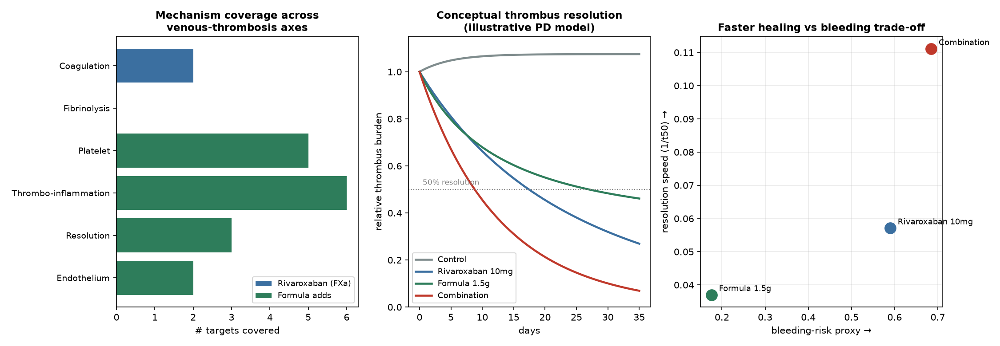

# 附：协同增效 / 减毒 / 加速痊愈 —— 机制评估与实验验证路线图

> 机制互补性(数据驱动) + 概念性 PD 模型(示意) + 严谨实验设计
> **核心立场：以下是“有机制支撑的科学假说 + 如何验证”，不是“已被证实的疗效结论”。**

---

## 一、诚实的科学定性（先说结论）

| 命题 | 机制层面 | 是否已证实 |
|---|---|---|
| **增效（互补覆盖）** | ✅ 合理：利伐沙班仅覆盖凝血 1 个轴，方剂补充血小板/炎症/消散/内皮 4 个轴 | ⚠️ 需实验(协同指数) |
| **加速痊愈** | ✅ 有基础：方剂独家提供 MMP 血栓重塑 + 抗炎，促再通/机化清除 | ⚠️ 需动物+临床终点 |
| **减毒（降低出血）** | ❌ 不成立：方剂**增加**而非降低抗栓负荷，出血方向叠加 | — |
| **减毒（剂量/疗程节约）** | 🟡 可能：若加速痊愈，或可缩短疗程/维持低强度(10mg)→降低累积出血暴露 | ⚠️ 需临床验证 |
| **减毒（非出血毒性）** | 🟡 可能：黄酮抗氧化/护内皮/护胃或缓解部分血管氧化损伤 | ⚠️ 推测 |

> **一句话：** “协同增效、加速痊愈”是 **有强机制支撑的阳性假说**；但“减毒”若指“降低出血”则 **不成立**——合理的减毒只能是 **剂量/疗程节约** 与 **方剂自身的血管保护**。任何结论都须经下文实验验证。

---

## 二、增效的数据基础：机制互补性

- 利伐沙班经 ChEMBL 确认为 **纯 FXa(F10) 抑制剂**（pChEMBL 9.4），仅覆盖 **凝血级联 1 个轴**。
- 方剂覆盖 **5/6 个轴**；二者靶点重叠仅 **F2**（Jaccard=0.005）→ **高度互补**。
- **方剂独家补充利伐沙班完全缺失的 4 个轴**：血小板活化 Platelet、血栓炎症 Thrombo-inflammation、血栓消散/重塑 Resolution、内皮/血管 Endothelium。

| 血栓病理轴 | 利伐沙班 | 方剂补充的靶点 |
|---|---|---|
| 凝血级联 Coagulation | F10;F2 | F2 |
| 纤溶 Fibrinolysis | — | — |
| 血小板活化 Platelet | — | ALOX12;ALOX15;GRK6;PTGS1;PTGS2 |
| 血栓炎症 Thrombo-inflammation | — | IL2;JAK2;NFKB1;NLRP3;PIK3R1;STAT6 |
| 血栓消散/重塑 Resolution | — | MMP12;MMP2;MMP9 |
| 内皮/血管 Endothelium | — | HIF1A;KDR |

> **要点：** 利伐沙班“**防止血栓增大/播散**”（阻断 FXa），方剂“**促进已形成血栓的消散/再通 + 抗炎护内皮**”（MMP2/9/12 重塑、NLRP3/NF-κB 抗炎、KDR/HIF 内皮）。两者针对血栓“**从形成到清除**”的不同阶段，构成互补——这是“增效/加速痊愈”的机制根据。**注意：两者均未覆盖直接纤溶(PLG/tPA)，是共同空白。**

---

## 三、加速痊愈的概念性 PD 模型（示意，非证据）

> ⚠️ 该模型速率常数为 **假设值**，用于 **形式化假说、生成可检验预测并展示出血权衡**，**不构成疗效证明**。

| 方案 | 血栓消散半数时间 t50 | 第35天残余 | 出血代理 | 单位出血获益 |
|---|---|---|---|---|
| Control | 未达50% d | 1.075 | 0.0 | inf |
| Rivaroxaban 10mg | 17.5 d | 0.269 | 0.59 | 0.097 |
| Formula 1.5g | 27.0 d | 0.461 | 0.176 | 0.21 |
| Combination | 9.0 d | 0.069 | 0.685 | 0.162 |

**模型预测（待验证）：**
- **联合方案血栓消散最快**（t50≈9.0d vs 利伐沙班17.5d vs 方剂27.0d）、残余最少 → 支持“加速痊愈”。
- **但联合方案出血代理最高**（0.685 vs 利伐沙班0.59）→ **“减毒(降出血)”不成立**。
- **单位出血的消散获益**：联合(0.162) > 利伐沙班单用(0.097) → 提示联合可能以 **更短疗程/更低强度** 达到同等消散（**剂量-疗程节约式“减毒”**）；方剂单用最温和但最慢。

---

## 四、需要补充的科学实验（验证路线图）

要把上述假说变成结论，须按 **计算 → 体外 → 体内 → 临床** four阶段验证，且每阶段都设 **出血安全性** 终点。

### 阶段 0 — 计算/结构（1–2 月）
- **分子对接 + MD 模拟**：quercetin/baicalein/isoliquiritigenin 对 F2、PTGS2、ALOX12、MMP9、NLRP3、KDR 的结合模式与亲和力（AutoDock Vina/Glide + GROMACS）。
- **成分定量**：UPLC-MS/MS 实测同仁堂大蜜丸中 quercetin、baicalein、emodin、甘草酸、水蛭素活性等真实含量（校正本项目的含量估算）。
- **完善 PBPK/PD**：将实测含量 + 水蛭素抗凝活性纳入定量出血叠加模型。

### 阶段 1 — 体外（3–6 月）
- **抗凝/抗栓功能试验**：PT、aPTT、**抗 FXa 活性**、**凝血酶生成试验(TGA/ETP)**、血栓弹力图(TEG)——比较利伐沙班、方剂提取物、联合。
- **血小板聚集**（ADP/胶原/花生四烯酸诱导）、TXB2、12-HETE 测定（验证 COX/LOX 抑制）。
- **纤溶/重塑**：D-二聚体、**MMP2/9 明胶酶谱(zymography)**、体外血栓块溶解试验。
- **内皮/炎症**：HUVEC 管腔形成、NO 生成、NLRP3/IL-1β、NF-κB 报告基因。
- **协同定量**：**Chou-Talalay 联合指数(CI)** 与 **等效线图(isobologram)**——判定协同(CI<1)/相加/拮抗。

### 阶段 2 — 体内（6–12 月）
- **静脉血栓动物模型**：大鼠/小鼠 **下腔静脉(IVC)狭窄或结扎淤滞模型**（最贴合静脉淤滞）、FeCl₃ 或光化学模型作补充。
- **分组**：溶媒、利伐沙班、方剂(高/低剂量)、联合(析因设计)，含 **人体等效剂量换算**。
- **疗效终点**：**血栓重量/长度、血栓消退率、血管再通率、组织学机化/再内皮化、炎症浸润**、时间曲线（验证“加速痊愈”）。
- **安全性终点**：**尾出血时间、出血量、血红蛋白、内脏出血评分**（量化“减毒”真伪）。
- **PK/PD**：联合下利伐沙班血浆浓度与抗 FXa（验证本项目 PBPK 的 AUCR≈1.03×预测）。
- **机制确证**：核心靶点(F2、MMP9、NLRP3、KDR)的 WB/IHC/qPCR；必要时基因敲除/抑制剂反证。

### 阶段 3 — 临床（1–3 年）
- **设计**：远端 DVT/肌间静脉血栓患者的 **前瞻性随机对照(优先)或前瞻性队列**；利伐沙班 ± 大黄蛰虫丸。
- **主要终点**：**血栓消退/再通时间（加速痊愈）**、血栓进展/复发率。
- **次要/安全终点**：**大出血与临床相关非大出血(ISTH 标准)**、血红蛋白、肝肾功能、血钾血压（甘草）。
- **样本量**：基于预试验效应量估算并预注册；设 **独立数据安全监察委员会(DSMB)**。
- **药物警戒**：结合 **中西药联用不良反应监测/真实世界数据** 追踪出血信号。

### 关键判定标准
| 假说 | 支持性证据阈值 |
|---|---|
| 增效/协同 | 体外 CI<1 + 体内联合组血栓消退显著优于单药(析因交互 p<0.05) |
| 加速痊愈 | 体内/临床 **再通时间显著缩短**、残余血栓更少 |
| 减毒(剂量节约) | 联合达同等消退所需 **利伐沙班强度/疗程更低**，且大出血不劣于标准 |
| 无 PK 风险 | 临床 PK 证实利伐沙班 AUC 无显著升高(呼应 AUCR≈1.03×) |

---

## 五、结论

> **“利伐沙班 10 mg qd + 半粒 1.5 g 大黄蛰虫丸”具备“协同增效、加速痊愈”的坚实机制基础**（互补覆盖 5/6 病理轴、独家提供血栓消散与抗炎），**PK 相互作用可忽略**（AUCR≈1.03×）。
>
> **但：** (1) “减毒”若指降低出血则 **不成立**（抗栓作用叠加）；合理减毒只能是 **剂量/疗程节约** 与 **血管保护**；(2) “增效/加速痊愈”目前是 **计算与概念模型层面的阳性假说**，**必须经上文体外协同(CI)、动物血栓模型与临床 RCT 验证**方能成立。
>
> **临床落地前提：** 专科监护、出血监测、个体化风险评估——**不可据此自我联用**。

> **免责声明：** 本节为计算性科研分析与实验设计建议，**不构成医疗建议**。
